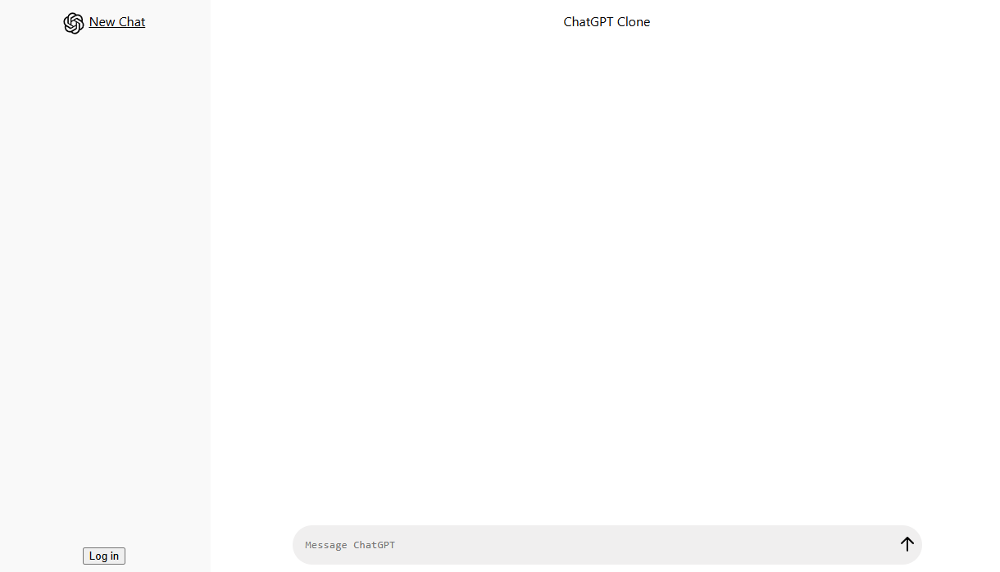

# ChatGPT clone using React (Frontend), deployed on Cloudflare Pages.

A cloned version of ChatGPT website written in JavaScript. Using OpenAI API to interact with OpenAI model.

## Screenshots


## Requirements
- [Cloudflare account](https://dash.cloudflare.com/sign-up)
- [Discord application with OAuth2](https://discord.com/developers/docs/topics/oauth2)
- [Node.js + npm](https://nodejs.org/en/download/prebuilt-installer/current)
- [OpenAI API keys](https://platform.openai.com/api-keys)
- [Upstash Redis](https://console.upstash.com/redis)

## Features
- [X]  Authentication via Discord OAuth2
- [X]  Display mathematical notation from GPT response with LaTeX markup
- [X]  Highlight code segment from GPT response and enclose in code block
- [X]  Interact with OpenAI GPT model using API
- [X]  Remember login by session cookies using KV
- [X]  Remove image in prompt by clicking on corresponding image
- [X]  Save & Load chat history using D1 database
- [X]  Upload image in prompt by Ctrl+V to utilize GPT-4 vision capabilities

## TODOs
- [X]  Button for deleting chat history
- [X]  Button for removing uploaded image in prompt
- [ ]  Button for uploading image instead of Ctrl+V only
- [ ]  Better UI design
- [ ]  Logout button
- [ ]  Responsive Web Design (Especially for mobile users)

## General installation
```
git clone https://github.com/yinkiu602/ChatGPT-clone-Cloudflare-Page.git
```

## Installation (Frontend)
```
Clone thie repository and create a page application on Cloudflare website by importing the cloned repo.
Create the required KV namespace and D1 table on Cloudflare.
```

## Chat saving
- All chat history will be automatically saved to database if the user is logged in.

## Datbase entry format
```
{
    "_id": "${random_chat_id_here}",
    "userId": "${user_id}",
    "title": "${title of the conversation}",
    "messages": [
        {
            "role": "user",
            "content": [
                {
                    "type": "text",
                    "text": "${user prompt}"
                }
            ]
        },
        {
            "role": "assistant",
            "content": "${response from GPT}"
        }
    ],
    "modified": ${Unix timestamp of last modification}
}
```

## Authors
- [@Josh Wong](https://github.com/yinkiu602)

## License
- [GNU v3.0 License](LICENSE)